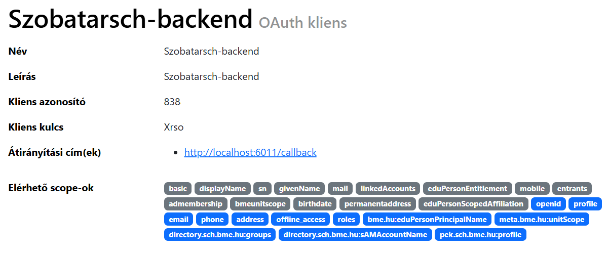
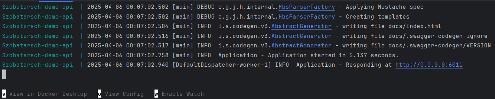

# Ktor előadás demo

## Projekt felépítés
* [Az alkalmazás backendje](szobatarsch-backend) 
* [Az alkalmazás KMP/CMP frontendje](szobatarsch-frontend) 

### Backend

A backend tartalmaz egy [Dockerfilet](szobatarsch-backend/Dockerfile) illetve egy [docker-compose fájlt](szobatarsch-backend/docker-compose.yaml).
Az alkalamzás elindításához szükséges a [docker](https://www.docker.com/products/docker-desktop/) letöltése és elindítása. *Ha nem szeretnéd hasznáni nézd meg a Futattás 1. pontját*

A szerver oldali Ktor használatárapélda a  [routes](szobatarsch-backend/src/main/kotlin/routes/) mappában található. Ezeket a [Routing.kt](szobatarsch-backend/src/main/kotlin/plugins/Routing.kt) fájl fogja össze. Végül az auth megvaolsítása [ebben a fájlban](szobatarsch-backend/src/main/kotlin/plugins/Security.kt) található.
Utóbbi kipróblásához regisztrálni kell egy OAuth klinst az [AuthSch-n](https://auth.sch.bme.hu/console/index)

A képen látható adatokat az [env fájlban](szobatarsch-backend/.env) a megfelelő értékek kitöltése után működik.

AUTH_SCH_CLIENT_ID=TODO

AUTH_SCH_CLIENT_SECRET=TODO

Ezt a http://localhost:6011/api/v1/hidden_rooms címen tudjátok kipróbálni.

### Frontend
A frontend egy teljes KMP projekt és támogatja az összes platformot (Android, iOS, Web, Asztali alkalmazás). Ennek fuattásának feltétele a futó backend, különben sok érdekesség nem fog megjelenni a UI-on.

Itt a Ktor kliens megvalósítás [itt](szobatarsch-frontend/SzobatarSCH/composeApp/src/commonMain/kotlin/hu/bme/kszk/service/api/Client.kt) található. A demó során említett hálózati hiba kezelő feautre pedig [itt](szobatarsch-frontend/SzobatarSCH/composeApp/src/commonMain/kotlin/hu/bme/kszk/util/). Használat közben a viewmodellekben lehet megnézni, például [ebben a fájlban](szobatarsch-frontend/SzobatarSCH/composeApp/src/commonMain/kotlin/hu/bme/kszk/myRoom/ui/MyRoomViewModel.kt).

A megfelelő HTTP engint ez a függvény biztosítja: `expect fun getHttpClientEngine(): HttpClientEngine`.
Megvalósításai: [Asztali alkalmazás](szobatarsch-frontend/SzobatarSCH/composeApp/src/desktopMain/kotlin/hu/bme/kszk/service/api/Client.desktop.kt),
[Android alkalmazás](szobatarsch-frontend/SzobatarSCH/composeApp/src/androidMain/kotlin/hu/bme/kszk/service/api/Client.android.kt),
[iOs alkalmazás](szobatarsch-frontend/SzobatarSCH/composeApp/src/iosMain/kotlin/hu/bme/kszk/service/api/Client.ios.kt),
[Web alkalmazás](szobatarsch-frontend/SzobatarSCH/composeApp/src/wasmJsMain/kotlin/hu/bme/kszk/service/api/Client.wasmjs.kt).

## Futtatás

1.  Nyisd meg az [Az alkalmazás backendjét](szobatarsch-backend) egy terminálban. **VAGY** [írd át a 17. sor értékét falsra.](szobatarsch-backend/src/main/kotlin/db/Databases.kt) **ÉS hagyd ki a 2. lépést, és futtasd IntelliJ-ből az alkalamzást** Ebben az estben nincs szükséged a dockerra.
2. Itt add ki a következő parancsot: `docker compose up --build`. 
3. Várd meg amíg felépül az alkalmzás és el kezd futni. 
4. Indítsd el tetszőleges platforon a frontendet a korábban tanultak alapján.
5. Androidon használd a saját IP-d, Ne loaclhost legyen, más platformon a loaclhost is megfelel a [Client.kt fájlban](szobatarsch-frontend/SzobatarSCH/composeApp/src/commonMain/kotlin/hu/bme/kszk/service/api/Client.kt) és ne feldd el ezt felvenni a megfelelő [xml fájlban](szobatarsch-frontend/SzobatarSCH/composeApp/src/androidMain/res/xml/network_security_config.xml) is. Más platformon nincs rá szükség.
